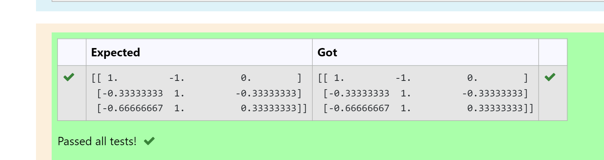

# INVERSE-OF-A-MATRIX
## DATE:16.08.2023
## Aim:
To write a python program to find the inverse of a matrix

## Equipment’s required:
1. 	Hardware – PCs
2. 	Anaconda – Python 3.7 Installation / Moodle-Code Runner

## Algorithm:
### Step1 : 
Import the numpy module to use the built-in functions for calculation 
### Step 2: 
Prepare the lists for  linear equation and assign in np.array()
### Step 3:
Using the np.linalg.inv(), we can find the solutions.
### Step 4: 
End the program

## Program:
```
#Program to find the inverse of a matrix.
import numpy as np
A=np.array([[2,1,1],[1,1,1],[1,-1,2]])
soln=np.linalg.inv(A)
print(soln)
#Developed by:PAVANA G 
#RegisterNumber:212222230105
```
## Output:


## Result:
Thus the inverse of given matrix is successfully solved using python program

